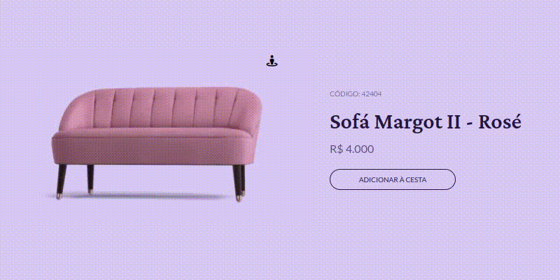

<h1 align="center"> Sofá Margot II - Rosé</h1>

Este projeto é uma página web que apresenta um produto, o sofá Margot II - Rosé. A página inclui uma imagem do produto, informações sobre o produto e um botão para adicionar o produto à cesta de compras.

 

  <a href="#🚀-tecnologias">Tecnologias</a>&nbsp;&nbsp;&nbsp;|&nbsp;&nbsp;&nbsp;
  <a href="#💻-projeto">Projeto</a>&nbsp;&nbsp;&nbsp;|&nbsp;&nbsp;&nbsp;
  <a href="#⏰-otimização">Otimização</a>&nbsp;&nbsp;&nbsp;|&nbsp;&nbsp;&nbsp;
  <a href="#🔖-layout">Layout</a>&nbsp;&nbsp;&nbsp;|&nbsp;&nbsp;&nbsp;
  <a href="#💾-instalação">Instalação</a>&nbsp;&nbsp;&nbsp;|&nbsp;&nbsp;&nbsp;
  <a href="#📖-como-usar">Como usar</a>&nbsp;&nbsp;&nbsp;|&nbsp;&nbsp;&nbsp;
  <a href="#📝-licença">Licença</a>

 

  

 

  

 

## 🚀 Tecnologias

Esse projeto foi desenvolvido com as seguintes tecnologias:

- HTML e CSS
- JavaScript
- Git e Github
- Figma
- Font Awesome para ícones
- Google Fonts para fontes

 

---

 

## 💻 Projeto

O projeto "Sofa Card Page" é um projeto que foi desenvolvido como desafio #2 no boraCodar da Rocketseat. O projeto consiste em uma página de venda com um sofá Margot II - Rosé, onde a página exibe um botão de view 360º para analisar melhor os detalhes do sofá.

 

- [Acesse o projeto finalizado, online](https://euvitordev.github.io/sofa-card-page)

 

---

 

## ⏰ Otimização

 

- Utilizado CSS Grid e Flexbox para organizar a estrutura da página.
- Utilizado variáveis CSS para definir cores, fontes e tamanhos.
- Utilizado o atributo srcset da tag img para carregar imagens otimizadas para diferentes tamanhos de tela.
- Utilizado o atributo async ou defer para carregar scripts de forma assíncrona.
- Utilizado uma ferramenta de minificação para reduzir o tamanho do código HTML, CSS e JS.
- Utilizado uma ferramenta de pré-processamento para escrever CSS de forma mais eficiente e organizada.

 

---

 

## 🔖 Layout

 

Você pode visualizar o layout do projeto através [DESSE LINK](https://www.figma.com/community/file/1195050984449538256). É necessário ter conta no [Figma](https://figma.com) para acessá-lo.

 

---

 

## 💾 Instalação

 

1. Faça o clone do repositório: git clone https://github.com/euvitordev/sofa-card-page.git.
2. Entre na pasta do projeto: cd -sofa-card-page.
3. Abra o arquivo index.html no seu navegador.

 

## 📖 Como usar

 

4. Clique no botão "ADICIONAR À CESTA" para adicionar o produto à cesta de compras.
5. Clique no botão com ícone de street-view para alternar entre a visão geral e a visão detalhada do produto.

 

---

 

## 📝 Licença

 

Esse projeto está sob a  

 

---

 

## 🇧🇷 Créditos

 

Este projeto foi desenvolvido por <a href="https://www.linkedin.com/in/euvtitordev/" target="_blank">Vitor Lucas</a>

 

---

 

## 📧 Contato

 

Se tiver alguma dúvida ou sugestão, entre em contato através do <a href="mailto:dev.vitorlucas@gmail.com" target="_blank">Entre em contato.</a>

 

---

 

<a href="https://instagram.com/euvitordev" target="_blank">Instagram</a>&nbsp;&nbsp;&nbsp;|&nbsp;&nbsp;&nbsp;
<a href="https://github.com/euvitordev" target="_blank">Github</a>&nbsp;&nbsp;&nbsp;|&nbsp;&nbsp;&nbsp;
<a href="https://linkedin.com/in/euvtitordev" target="_blank">LinkedIn</a>&nbsp;&nbsp;&nbsp;|&nbsp;&nbsp;&nbsp;
<a href="https://www.youtube.com/channel/UCgLnCW07t-4-y9YgDwI6bSw" target="_blank">Youtube</a>&nbsp;&nbsp;&nbsp;|&nbsp;&nbsp;&nbsp;
<a href="https://discord.gg/rm3sDKjf69" target="_blank">Discord</a>

 

Feito com ❤ por  <a href="https://www.linkedin.com/in/euvtitordev/" target="_blank">Vitor Lucas</a>
